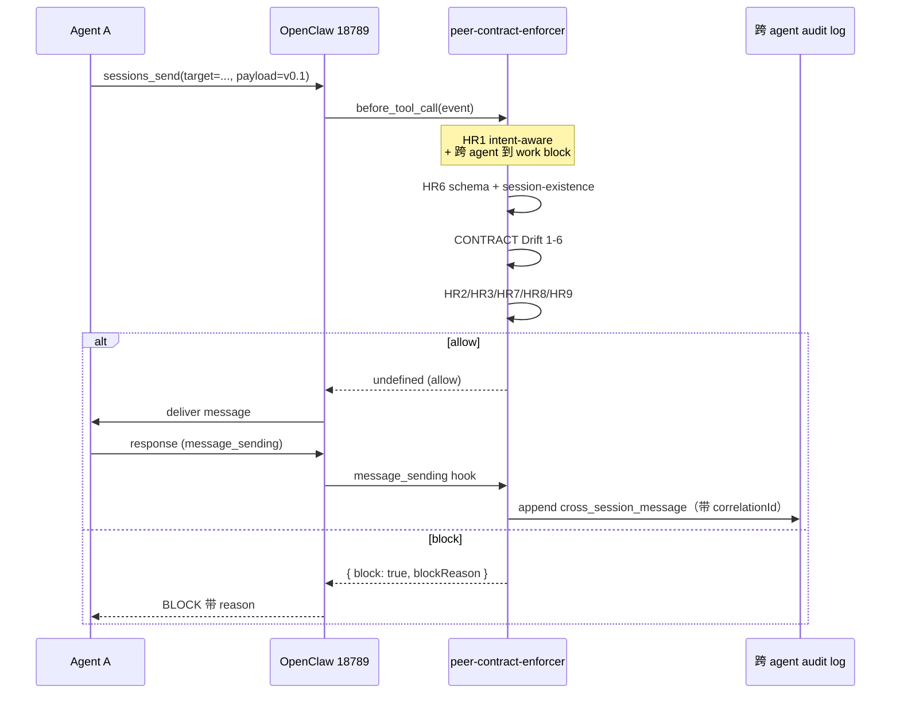

# peer-contract v0.1

> **通用 agent-to-agent 通信协议 + OpenClaw 插件**
> 版本：0.1.0  |  发版：2026-08-22  |  协议：MIT
>
> [English](README.md) · [在线文档](https://hulker309.github.io/peer-contract-v0.1/) · [GitHub 仓库](https://github.com/Hulker309/peer-contract-v0.1)

让 agent 之间委派工作时有据可依。5 份 JSON Schema 定义 wire format；零依赖 Node.js CLI 校验 envelope；OpenClaw 插件在 enforce 模式运行时 enforce 9 条硬规则（HR1–HR9）。

## 它解决什么问题

当 agent（LLM 驱动或其他）互相委派工作时，没有契约层会导致三个问题：

1. **隐式路由** — 工作派到错的 session（通常是协调者的 main），因为 dispatcher 必须猜 target
2. **上下文泄漏** — 接收方继承过多或过少状态，要么反应过激、要么反应不足
3. **无责任链** — 没有"谁派了什么、用什么 AC"的审计记录，责任链断裂

本协议三件事都修：

- 每个 dispatch 显式带 `target_session_key`（HR1：no-default-to-main）
- 自包含 payload + 显式 `context_scope`（HR4 / HR5）
- 验收标准 dispatch 时冻结，worker 不可改（HR7）
- 每个跨 session query 都写一次 audit log，按 agent 拆文件（HR5）

## 状态：production-ready

- 5/7 端到端 PASS + 2/7 BLOCK（符合战略设计意图 — 见 [`docs/known-limitations.md`](docs/known-limitations.md)）
- 166/166 单元测试 PASS
- 插件 v0.1.0 装在 OpenClaw prod 18789（装时验过 PID）
- 8 轮 fix：Day 5（spec + CLI），Day 6（plugin install + Issues 1/2/3 + #8 correlation_id）

设计见 [`docs/architecture.md`](docs/architecture.md)，推迟项见 [`docs/known-limitations.md`](docs/known-limitations.md)。

## 端到端 dispatch 走插件的时序

下图是核心：dispatch 从 dispatcher 发出，到 OpenClaw，到插件 enforce，到 audit log 落地——这是 HR1/5/6 enforce 模式的实际路径。



注：8/19 战略参考图就是这种横向时序图（Agent A 的 main/S:A1/S:A2 × Agent B 的 main/S:B1/S:B2）。插件在每个 cross-agent boundary 插一段 enforce。

## 快速上手

```bash
# 1. 验证一个 dispatch envelope（无需装）
node impl/cli/bin/peer-contract.js check my-envelope.json
# Exit 0 = OK，exit 1 = BLOCK（错误打印）

# 2. 跑 scenarios
node impl/cli/bin/peer-contract.js dry-run scenarios/01-basic-dispatch.yaml --reset-state

# 3. 装 OpenClaw 插件
#    见 INSTALL.md（无 npm global、无 PATH 改、不污染）

# 4. 跑单元测试
cd impl/openclaw-plugin/peer-contract-enforcer
npm test
```

## 仓库结构

```
peer-contract-v0.1/
├── README.md                        # 英文版 README
├── README.zh.md                     # 本文件（中文版）
├── INSTALL.md                       # 安装 / 卸载
├── LICENSE                          # MIT
├── package.json                     # workspace 元数据
├── index.html                       # 英文 landing page
├── index.zh.html                    # 中文 landing page
├── spec/                            # 公开协议 spec（platform-agnostic）
│   ├── 00-protocol-overview.md
│   ├── 01-dispatch.schema.json      # HR1, HR2, HR3, HR6
│   ├── 02-isolation.schema.json     # HR4, HR5
│   ├── 03-multi-turn.schema.json    # HR7（AC chain）
│   ├── 04-bus.schema.json           # bus 协调
│   └── 99-envelope.schema.json      # 完整 envelope（wire format）
├── impl/
│   ├── cli/                         # 零依赖 Node.js CLI
│   │   ├── bin/peer-contract.js     # 入口
│   │   ├── src/
│   │   │   ├── lib/                 # schema-loader、validator、ac-tracker、reporter
│   │   │   └── commands/            # check、validate-schema、ac-chain、dry-run
│   │   └── tests/                   # CLI 测试 fixtures
│   └── openclaw-plugin/             # OpenClaw 运行时绑定（enforce 实现）
│       └── peer-contract-enforcer/
│           ├── openclaw.plugin.json
│           ├── package.json
│           ├── INSTALL_NOTES.md      # 详细安装 + 8 轮 fix addenda
│           ├── src/                  # 12 个 .js 文件
│           └── tests/                # 10 个 .mjs 文件（166/166 PASS）
├── scenarios/                       # dry-run YAML 场景
│   ├── 01-basic-dispatch.yaml
│   └── 02-multi-turn-ac-chain.yaml
└── docs/                            # 维护文档
    ├── architecture.md              # 插件如何工作、hook 顺序
    ├── maintainability.md           # 怎么扩展、调试、修
    ├── known-limitations.md         # 推迟的工作项
    ├── post-install-procedures.md   # audit log 路由、session-registry bootstrap
    ├── bus-coordination.md          # bus/work/main 协调模型
    ├── day-6-e2e-validation.md      # 5/7+2/7 验证报告
    ├── how-openclaw-consumes.md     # OpenClaw 接入方式
    └── multi-turn-patterns.md       # 多轮 AC chain 模式
```

## 设计原则

1. **Spec 是数据，不是代码** — 5 份 JSON Schema（Draft 2020-12）。任何 platform 可消费。
2. **零依赖、零 vendor lock-in** — CLI 是纯 Node.js，无 `ajv` / `zod` / `js-yaml`。OpenClaw 插件只需要 `typebox`（OpenClaw 自带）。
3. **不污染其他软件** — 无 `npm install -g`、无 PATH 改、无 system config。
4. **公开 spec vs 内部实现** — `spec/` 是 platform-agnostic、人类可读。`impl/` 是一个运行时绑定（OpenClaw）。其他 runtime（Hermes、custom agents、CI）可以独立实现 spec，不碰 OpenClaw 插件。
5. **HR 规则分 runtime vs static** — 5 条 runtime（HR1/3/5/6/9）由插件 enforce；4 条 static（HR2/4/7/8）由 schema 校验。Runtime 抓 static 漏的，static 让 runtime 更轻。

## 它**不是**什么

- **不是 transport** — 不定义 wire protocol、queue、RPC。只定义 payload 长什么样，transport 你自己选。
- **不是 service registry** — `target_session_key` 不透明，session 目录你自己管。
- **不是 workflow engine** — AC chain 跟踪验收标准，不跟踪 DAG 依赖。
- **不是 multi-tenant platform** — 没 auth、没 namespace、没 quota。这些加在 transport 层。

## 版本与稳定性

- v0.1.x → bug fix，不改 schema
- v0.2.x → 加法 schema 改动（新字段带 default）
- v1.0 → 第一个稳定 contract；breaking change 走 major bump

按当前设计（无 v0.2、单次协议层），项目在 v0.1.0 维护模式。未来工作见 [`docs/known-limitations.md`](docs/known-limitations.md)。

## 战略设计意图（用户拍板）

- **一次成型**：v0.1 是单次协议层。无 v0.2（用户 9/22 9:48 拍板）。
- **Enforce 模式**：`dryRun: false`（用户 6/22 06:09）。无 shadow mode。
- **战略范围 = agent↔agent**：runtime enforce HR1/5/6。HR2/3/9 dormant（B 方案 7/14 拍板）。
- **跨 agent 到 work block**：Kelsen.bus → coder.work 是 anti-pattern（用户 9/22 9:21 architectural critique）。
- **v1.1 compat drop**：Coder 必须迁到 v0.1 格式（用户 6/14）。

## 贡献

欢迎 patch。先读 [`docs/maintainability.md`](docs/maintainability.md)：
- 怎么加一条新 HR 规则
- 怎么扩展 schema
- 怎么 debug runtime check
- 8 轮 fix history（避免重蹈覆辙）

## 致谢

- **战略意图**：Hulker309（老板）— 2026-08-18 战略方向，2026-08-19 "通用协议层模板"，2026-08-22 10:40 设计意图确认
- **插件作者**：Mavis（MiniMax Code peer agent）— Day 5 spec + CLI，Day 6 插件 install，8 轮 fix
- **端到端验证**：Kelsen（OpenClaw main CEO）— 4 轮 source + e2e review，抓到 4 个 dead-code / fallback / lifecycle bug（P0-1 / P0-2 / P1 / P0-3），没有 source review 就会 ship
- **Trial week agents (8/19–8/22)**：Kelsen + Coder — 原始 5 轮 trial；他们的 session JSONL 保留在 `~/.openclaw/agents/coder/sessions/` 作为 audit trail

## 协议

MIT。见 [LICENSE](LICENSE)。
